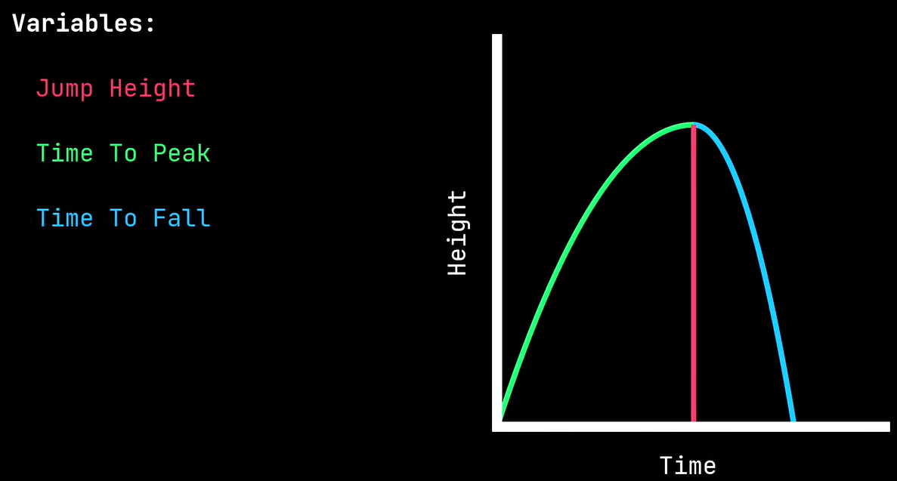
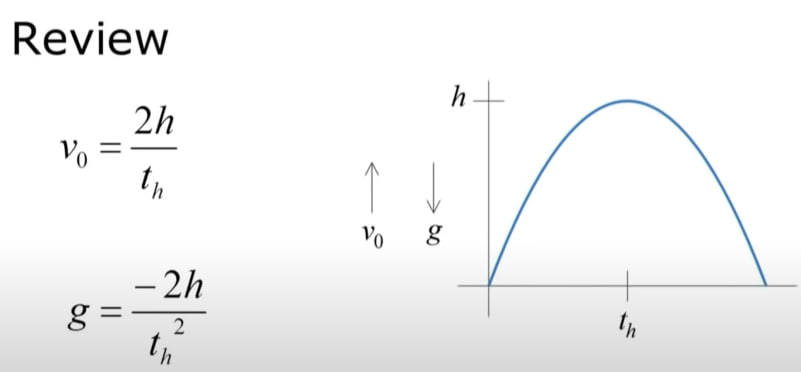
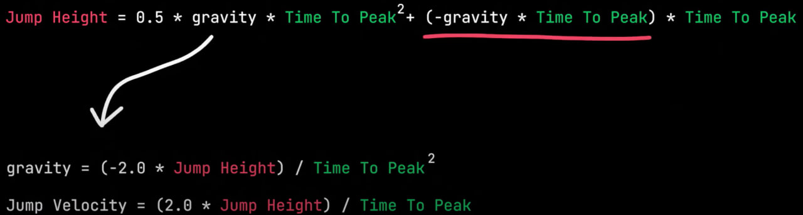
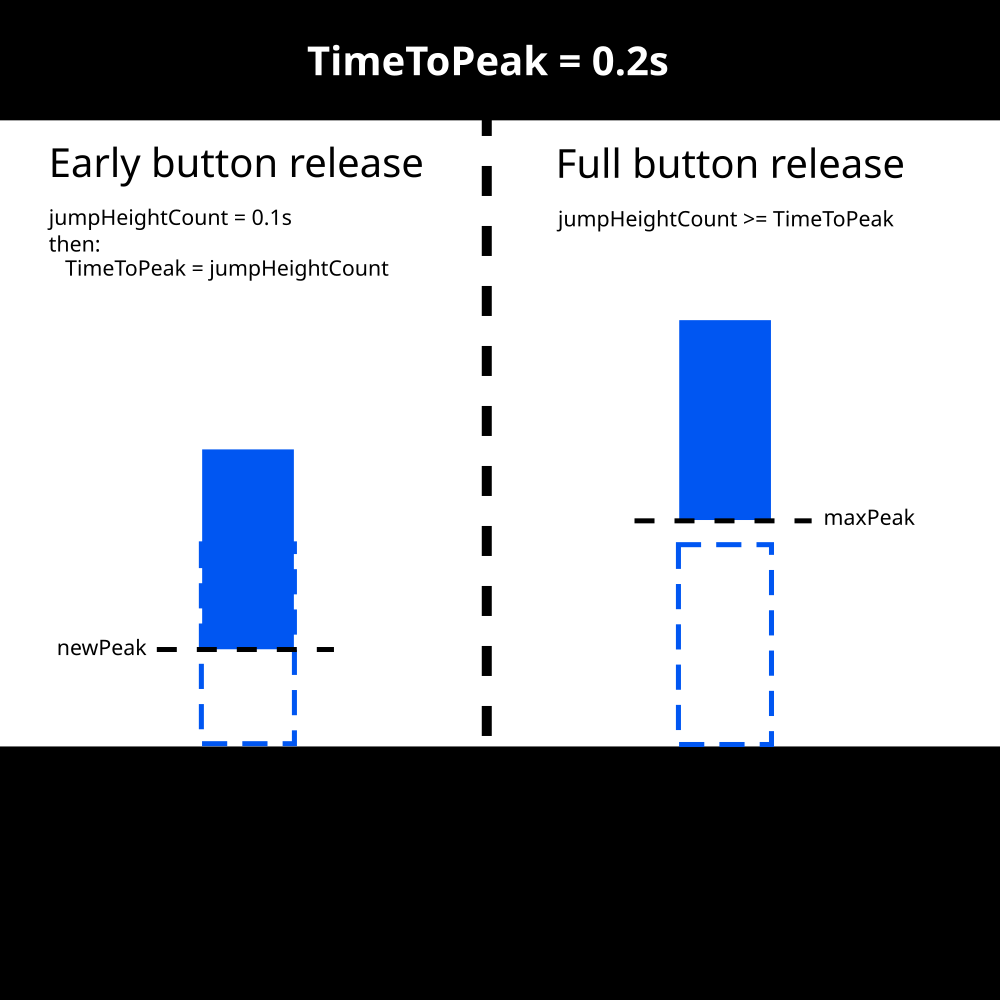
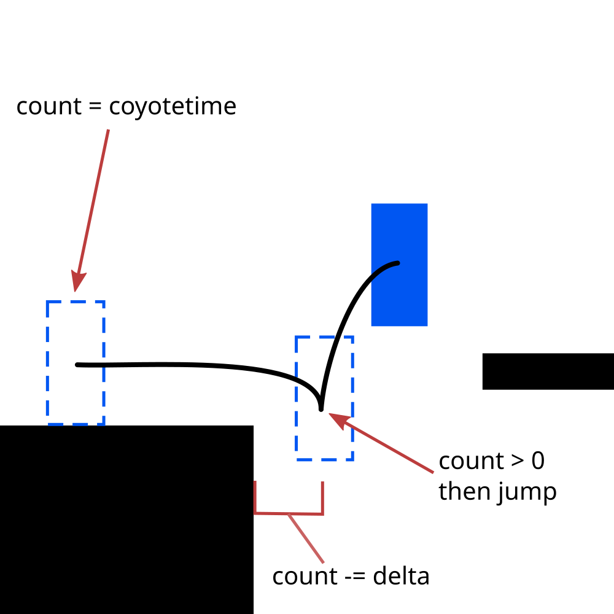

- [A quick breakdown on 2D character controllers](#a-quick-breakdown-on-2d-character-controllers)
  - [Simple movement](#simple-movement)
  - [Jumping](#jumping)
  - [Jump buffering](#jump-buffering)
  - [Variable jump height](#variable-jump-height)
  - [Coyote time](#coyote-time)
- [Prototyping](#prototyping)
- [CREDITS](#credits)

# A quick breakdown on 2D character controllers 

Hi! I'm Dan and I want to use physics to make a good 2D character controller. I tried to learn from masters watching some tutorials covering this topic. Here, I'll also try to implement all the accessories like *coyote time* or *jump height*.

I hope this will be an helpfull study case! Let's dive in.

## Simple movement 

As shown in the interesting video [The ULTIMATE 2D Character CONTROLLER in UNITY](https://www.youtube.com/watch?v=lcw6nuc2uaU) (from Shinjingi) a way to make **horizontal movement** is to take track of a `desiredVelocity` vector and then interpolate the current velocity using an `acceleration` parameter.

```c#
// compute desiredVelocity vector
direction.X = input.RetriveMoveInput();
desiredVelocity = new Vector2(direction.X, 0f) * maxSpeed;

// accelerate towards desiredVelocity
acceleration = IsOnFloor() ? maxAcceleration : maxAirAcceleration;
maxSpeedChange = acceleration * (float)delta;
velocity.X = Mathf.MoveToward(velocity.X, desiredVelocity.X, maxSpeedChange);

// apply velocty to the character controller
Velocity = velocity;
```

## Jumping
To make a better jump we can use physics to calculate the time needed to reach the peak of the jump and the time needed to fall back. This allow us to model a non parabolic movement which (as stated in [Math for Game Programmers: Building a Better Jump](https://www.youtube.com/watch?v=hG9SzQxaCm8)) is more interesting for the player.

Following the guide [Making a Jump You Can Actually Use In Godot](https://www.youtube.com/watch?v=IOe1aGY6hXA) I learned that the jump can be split in three main elements

- 🔝 Jump Height
- 🕛 Time To Peak
- 🕧 Time To Fall







We can model the gravity to depend on the y velocity. In fact we can say that if we are ascending, we calculate the gravity as 

`gravity = (-2.0 * JumpHeight) / TimeToPeak^2`

If we are falling we use

`gravity = (-2.0 * JumpHeight) / TimeToFall^2`

Here a written version of the video ([Physics for Game Dev — A Platformer Physics Cheatsheet](https://medium.com/@brazmogu/physics-for-game-dev-a-platformer-physics-cheatsheet-f34b09064558#:~:text=Jump%20Height%20(and%20Velocity)&text=For%20that%2C%20we'll%20take,i.e.%20v%20%3D%20v'%2B%20gt))

## Jump buffering

Is a technique that allow us to buffer for a short period of time the next jump so the player will jump as soon as it touch the ground.

I have a `jumpRequest` variable and time limit

```
if (jumpBuffer)
{
	// jump buffering
  if (jumpBufferTime < jumpBufferLimit)
  {
  	jumpBufferTime += (float)delta;
  }
  else
  {
  	jumpBufferTime = 0.0f;
   jumpBuffer = false;
   return;
  }

  if (isOnFloor || jumpPhase < maxAirJumps)
  {
  	 jumpBuffer = false;
    jumpPhase += 1;
		currentVelocity.Y = -Mathf.Sqrt(2.0f * jumpHeight * gravity) / (float)delta;   
	}
}
```

## Variable jump height
For this to work I thought of how my system currenly works. Looking on how gravity depends on `TimeToPeak` and `TimeToFall`, I decided to use a counter to track jump height. If I release early the jump button, I'll switch  `TimeToPeak` with the current `heightCount`.

```
// change jumpGravity if released before reaching the peak
if (!isJumping && currentVelocity.Y < 0f) 
	jumpGravity = 2.0f * jumpHeight / (jumpHeightCount * timeToPeak);
	
if (isJumping)
{
	if (jumpHeightCount < timeToPeak) 
		jumpHeightCount += (float)delta;
	
	...
}
```



## Coyote time
Following the video [Coyote Time & Jump Buffering In Unity](https://www.youtube.com/watch?v=RFix_Kg2Di0), I managed to build a working coyote time! I starte with making a varibale `coyoteTimeCount` that counts time while in air. While this count is greater than 0 I can still jump.

While I'm still on ground I just set the count to the coyoteTime (I choose 0.2s).

```
// coyote time
coyoteTimeCount = isOnFloor ? coyoteTime : coyoteTimeCount - (float)delta; 
if (coyoteTimeCount <= 0f) jumpPhase = maxAirJumps;
```



## Squash & Strech

// TODO

# Prototyping

All the implemented code can be found in [CharacterController.cs](Source\Scripts\Controllers\CharacterController.cs)

- [x] Charater controller
    - [x] simple movement
    - [x] better Jump ([link](https://www.youtube.com/watch?v=hG9SzQxaCm8&t=11s))
    - [x] jump height
    - [x] Coyote timer
    - [x] jump buffering
    - [x] dash
		- [x] simple dash
		- [x] dash with cooldown
    - [x] handling slopes
    - [x] basic squash & strech effect 

---
# CREDITS
- [You Need to Implement These in Your Character Controller](https://medium.com/@jharoldcameron/you-need-to-implement-these-in-your-character-controller-b74bdd7f5d6)
- [Simple 2D Character Controller](https://roystan.net/articles/character-controller-2d/)
- [How to make a good platforming character (Developing 6)](https://www.youtube.com/watch?v=ep_9RtAbwog)
- [The ULTIMATE 2D Character CONTROLLER in UNITY](https://www.youtube.com/watch?v=lcw6nuc2uaU)
- [A Perfect Jump in Unity - A Complete Guide](https://www.youtube.com/watch?v=RPdn3r_tqcM)
- [Recreating Celeste's Movement | Mix and Jam](https://www.youtube.com/watch?v=STyY26a_dPY)
- [Ultimate 2D Platformer Controller in Unity (source code provided)](https://www.youtube.com/watch?v=3sWTzMsmdx8)
- [Math for Game Programmers: Building a Better Jump](https://www.youtube.com/watch?v=hG9SzQxaCm8)
- [Making a Jump You Can Actually Use In Godot](https://www.youtube.com/watch?v=IOe1aGY6hXA)
- [Physics for Game Dev — A Platformer Physics Cheatsheet](https://medium.com/@brazmogu/physics-for-game-dev-a-platformer-physics-cheatsheet-f34b09064558#:~:text=Jump%20Height%20(and%20Velocity)&text=For%20that%2C%20we'll%20take,i.e.%20v%20%3D%20v'%2B%20gt)
- [Coyote Time & Jump Buffering In Unity](https://www.youtube.com/watch?v=RFix_Kg2Di0)
- [Godot Squash and Stretch Tutorial!](https://www.youtube.com/watch?v=g53fkpHvoGA)
